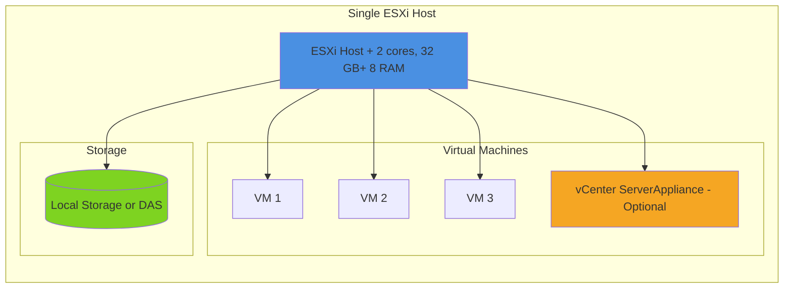

# Topology 1: Single Host (Basic)

## 1.1 Description
Simplest VMware setup with a single ESXi host managed by vCenter (optional). Suitable for
development, testing, or small labs.

## 1.2 Components
• 1× ESXi Host
• 1× vCenter Server Appliance (VCSA) – optional, can run as VM on the host
• Local or DAS (Direct Attached Storage)
• Standard vSwitch for networking

## 1.3 Architecture

## 1.4 Limitations
× No high availability
× Single point of failure
× Limited scalability
× No vMotion capability (requires shared storage)

