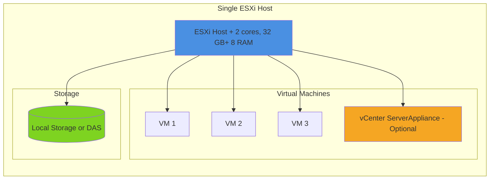
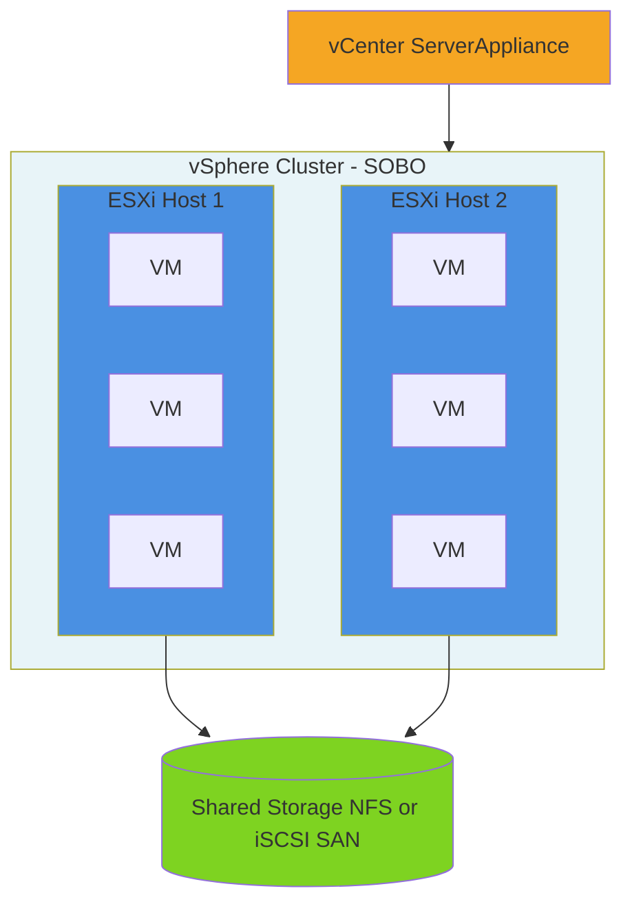
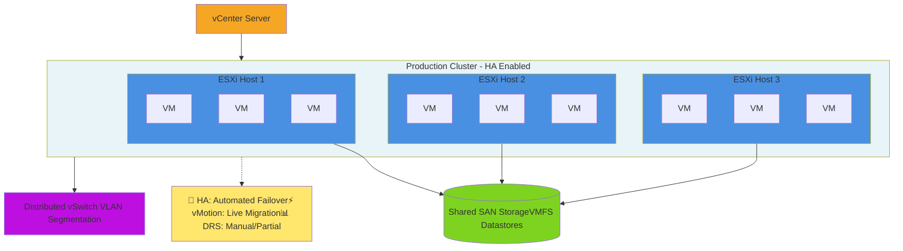
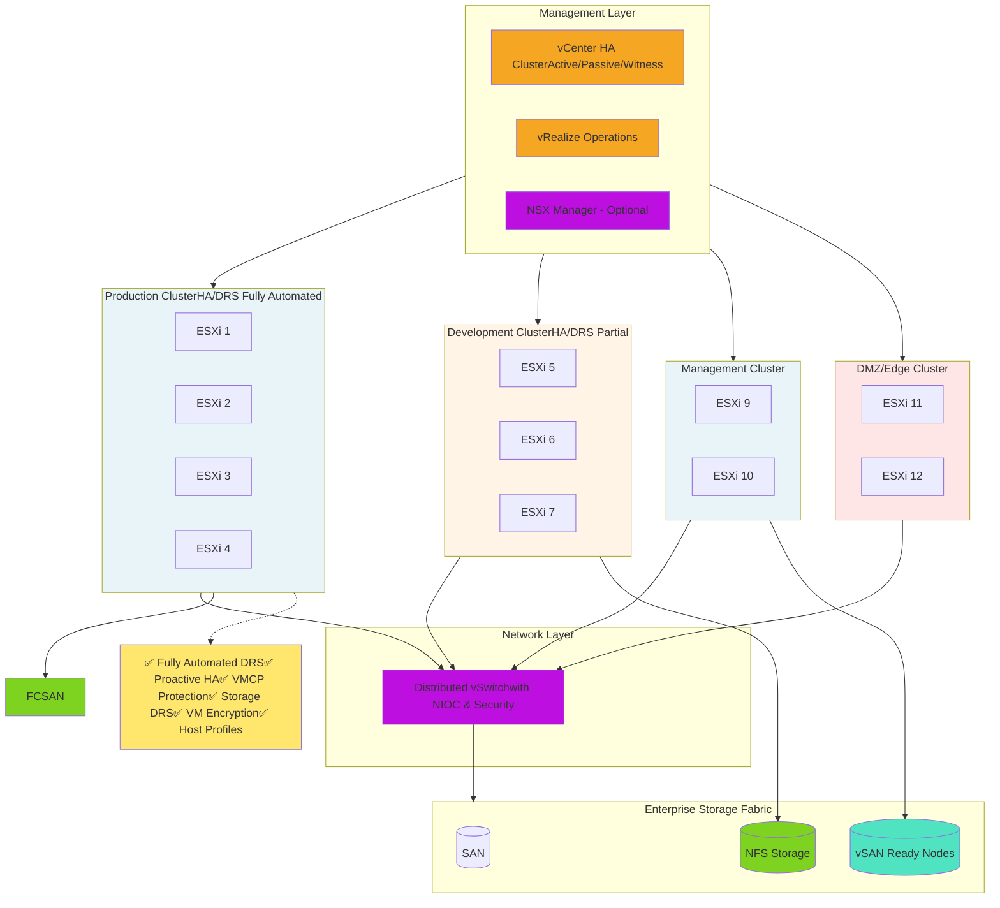

# Topology 1: Single Host (Basic)

## 1.1 Description
Simplest VMware setup with a single ESXi host managed by vCenter (optional). Suitable for
development, testing, or small labs.

## 1.2 Components
• 1× ESXi Host
• 1× vCenter Server Appliance (VCSA) – optional, can run as VM on the host
• Local or DAS (Direct Attached Storage)
• Standard vSwitch for networking

## 1.3 Architecture



## 1.4 Limitations
× No high availability

× Single point of failure

× Limited scalability

× No vMotion capability (requires shared storage)

## Reference
https://techdocs.broadcom.com/us/en/vmware-cis/vsphere/vsphere/8-0/esxi-upgrade-8-0/upgrading-esxi-hosts-upgrade/esxi-requirements-upgrade/esxi-hardware-requirements-upgrade.html 

# 2 Topology 2: Small Office / Branch Office (SOBO)

## 2.1 Description
Two ESXi hosts with shared storage, providing basic redundancy and the ability to perform maintenance without downtime.

## 2.2 Components
• 2× ESXi Hosts

• 1× vCenter Server Appliance

• Shared storage (NFS or iSCSI SAN)

• Standard or Distributed vSwitch

• vSphere Essentials Plus licensing

## 2.3 Architecture


## 2.4 Features Enabled
X vMotion (live migration)

X Basic HA (manual restart)

X Shared storage


## 3 Topology 3: Basic Production Cluster

# 3.1 Description

Three or more ESXi hosts in a cluster with HA enabled, providing automated failover and better
resource distribution.

# 3.2 Components
• 3–5× ESXi Hosts

• 1× vCenter Server Appliance

• Shared storage (SAN/NAS)

• Distributed vSwitch

• vSphere HA enabled

• Basic DRS (manual or semi-automated)

## 3.3 Architecture


## 3.4 HA Configuration
• Admission control: Host failures tolerated = 1

• VM restart priority levels

• Host isolation response

## 4 Topology 4: Enterprise with HA/DRS
## 4.1 Description
Large-scale production environment with fully automated DRS, advanced HA, and multiple clusters for workload separation.

## 4.2 Components
• 6–16× ESXi Hosts (multiple clusters)

• vCenter Server HA (3-node deployment)

• Enterprise shared storage (FC SAN or NFS)

• Distributed vSwitch with NIOC

• Fully automated DRS

• vRealize Operations (optional), NSX (optional)

## 4.3 Architecture



## 4.4 DRS Configuration
• Automation level: Fully automated

• Migration threshold: Conservative to aggressive

• VM-VM and VM-Host affinity/anti-affinity rules

# 5 Topology 5: Multi-Site with Disaster Recovery
# 5.1 Description
Geographically distributed infrastructure with automated failover capabilities between sites using Site Recovery Manager (SRM).
# 5.2 Components
• 2+ Data Centers (Primary + DR site)

• Multiple clusters per site

• vCenter Server with Enhanced Linked Mode or vCenter HA

• Site Recovery Manager (SRM)

• vSphere Replication or array-based replication

# 5.3 Architecture
```mermaid
flowchart TB
    subgraph Primary["Primary Data Center"]
        direction TB
        
        subgraph PrimaryMgmt["Management"]
            vCenter1[vCenter Primary]
            SRM1[Site Recovery Manager]
        end
        
        subgraph PrimaryCluster["Production Cluster - Primary"]
            direction LR
            P_ESXi1[ESXi-1]
            P_ESXi2[ESXi-2]
            P_ESXi3[ESXi-3]
        end
        
        PrimaryStorage[(Primary StorageSAN/vSANProtection Groups)]
        
        vCenter1 --> PrimaryCluster
        SRM1 -.-> vCenter1
        PrimaryCluster --> PrimaryStorage
    end
    
    Replication[("🔄 Replication───────────vSphere ReplicationorArray-Based───────────RPO: 5-15 min")]
    
    subgraph Secondary["DR / Secondary Data Center"]
        direction TB
        
        RecoveryStorage[(Recovery StorageSAN/vSANRecovery Plans Ready)]
        
        subgraph RecoveryCluster["Production Cluster - Recovery"]
            direction LR
            R_ESXi4[ESXi-4]
            R_ESXi5[ESXi-5]
            R_ESXi6[ESXi-6]
        end
        
        subgraph RecoveryMgmt["Management"]
            vCenter2[vCenter Recovery]
            SRM2[Site Recovery Manager]
        end
        
        RecoveryStorage --> RecoveryCluster
        vCenter2 --> RecoveryCluster
        SRM2 -.-> vCenter2
    end
    
    NetworkExtension["🌐 Network ExtensionNSX / L2 StretchCross-site vMotion"]
    
    PrimaryStorage ==> Replication
    Replication ==> RecoveryStorage
    
    SRM1  SRM2
    vCenter1  vCenter2
    
    Primary -.-> NetworkExtension
    Secondary -.-> NetworkExtension
    
    Objectives["📊 Recovery ObjectivesRTO: 1-4 hoursRPO: 5-15 minutes"]
    
    Replication -.-> Objectives
    
    style Primary fill:#E8F4F8
    style Secondary fill:#FFF4E6
    style vCenter1 fill:#F5A623
    style vCenter2 fill:#F5A623
    style SRM1 fill:#FF6B6B
    style SRM2 fill:#FF6B6B
    style PrimaryStorage fill:#7ED321
    style RecoveryStorage fill:#7ED321
    style Replication fill:#BD10E0
    style NetworkExtension fill:#50E3C2
    style Objectives fill:#FFE66D
```


